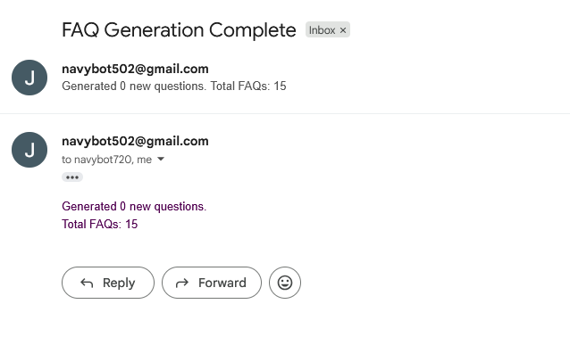
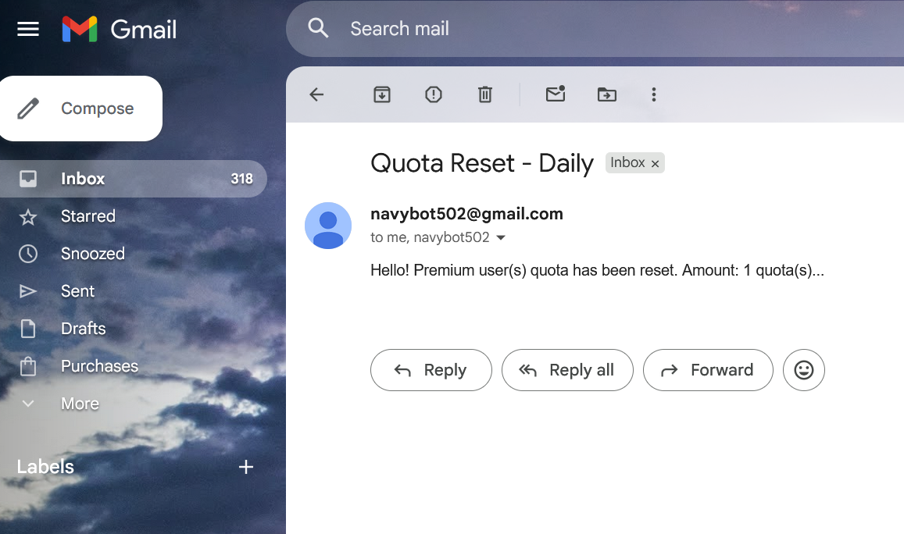

# Company Handbook - AI-Powered Q&A

A modern **AI-powered company handbook** designed to streamline onboarding and internal Q&A. This project leverages a **RAG (Retrieval-Augmented Generation) pipeline** to process company PDFs and provide a chat-like interface for employees to query company policies, procedures, and guidelines efficiently.

---

## Features

- **RAG Pipeline**: Converts company PDFs into embeddings using OpenAI LLM and stores them in Pinecone for fast retrieval.
- **Chat Interface**: React frontend providing a seamless Q&A experience for employees.
- **Automated PDF Management**: Django CRON tasks clean old PDF vectors from Pinecone to maintain storage efficiency.
- **Background Tasks**: Celery + Beat for periodic tasks, including PDF processing and embedding updates.
- **Secure API**: Django REST Framework handles all backend operations securely.

---

## Tech Stack

- **Backend**: Django REST Framework  
- **Frontend**: React.js  
- **Vector Database**: Pinecone  
- **LLM**: OpenAI GPT (via embeddings & response generation)  
- **Task Queue**: Django Celery + Beat  
- **PDF Processing**: PyMuPDF (fitz) reading PDFs 

---

## Architecture Overview

1. **PDF Upload**  
   - Admin uploads new company PDFs via Django REST endpoints.  
2. **Embedding Generation**  
   - Celery tasks extract text from PDFs and generate embeddings using OpenAI.  
3. **Vector Storage**  
   - Embeddings stored in Pinecone under a **namespace per PDF**.  
4. **CRON Cleanup Task**  
   - A periodic task filters the `Namespace` model to identify old PDFs and removes outdated embeddings from Pinecone.  
5. **Q&A Chat**  
   - Users interact with the React frontend, which queries Pinecone for relevant embeddings and generates answers using GPT.  

---

## Development Phase 

Keeping Track of Development Progress

### 09/04

- [x] Building out Django Application Template 
- [x] Custom User + Handbook Model 
  - Set up Media Files in settings
  - Foreign key One-Many 
  - Create seperate app **(Remember to migrate Custom user first)**
  - File Uploads support PDF ONLY
- [x] CRUD Handbook --> Using Restframework 
  - Parital Updates 
  - Serializer Mixin + Url Hyperlink 
  - Multipart Form Parsers
- [ ] ~~Register Users~~ Tomorrow 

### 09/05

- [x] Set Up homepage for Django Restframework 
  - Make APiView with reverse links  
- [x] Work on User Auth + JWT 
  - SJWT + Djoser
  - Djoser requires custom `UserCreateSerializer` since we changed to a **Custom User Auth Model**
  - [Endpoints](https://djoser.readthedocs.io/en/latest/jwt_endpoints.html):
    - `company/users/` (Create User)
    - `/company/jwt/create/` (Login + JWT)
    - `/company/jwt/verify/` (Verify Access Token)
    - `/company/jwt/refresh/` (Refreshing Access Token)
- [x] List All Users
  - Comapnies Url now has an `app_name` so we updated all the url references to: `comapnies:<company_view_name>`
  - Hyperlinked Handbook to Companies and vice versa 
    - `serialiers.HyperlinkedRelatedField` 
- [ ] ~~Work on Pinecone + LLM~~ (Tomorrow) 
  - `pip install pinecone-client` then we set up in **settings.py**
- [x] Guard our Handbook API (Auth ONLY)
  - Custom Permission?? --> IsOwnerOrAdmin --> `return obj.company == request.user`
  - `IsOwnerOrAdminHandbook` only applies to **Retrieve Update or Destroy** but cannot be applied on **List**

We also created two seperate Serializer for List vs Get Handbook API 
- Since we've updated the permissions for Owner or Admin we want to only allow the owners | admins to retrieve, update, destroy their own record 
- Listing Handbook
  - We've removed some important details like pdf link and the time it was created 
  - This allows **EVERYONE** to see that the record exists without seeing all the details 
- Retrieve Update Destroy Handbook 
  - Protected via `IsOwnerOrAdminHandbook` permission 
  - Other unauthorized users CANNOT see the important details...

### 09/09
- [x] Work on Pinecone + LLM
  - `pip install pinecone-client`
  - Create a service to return our **pinecone index** + **openai_embeddings**
  - Connect & Read PDF
  - Langchain
    - `pip install pinecone langchain langchain-pinecone langchain-openai`
    - Set up your Recursive Text Splitter 
    - Split up your text 
  - Langchain_pinecone 
    - Ingest splitter into Pinecone via **embeddings**
- [x] PDF Ingestion
  - **fitz** --> `pip install PyMuPDF`
  - **Lazy Init** by importing ONLY in the **create** Request in our API View 
    - Be sure to put this **service** folder under our app then import via **absolute**: `handbook_app.services.pinecone_services`
- Error that we'll run into:
  - Namespace --> we'll be using the format `f'{company_name}-{pdf_namespace}'` 
  - This way we use **ONE** index for **MULTIPLE** companies since we'll be filtering during **query stage**

**Pinecone + LLM Recap**

Objective: **Split, embed, ingest**

**Splitting**

```py
from langchain_text_splitter import RecursiveCharacterTextSplitter

# Given a text variable --> pdf reader return
splitter = RecursiveCharacterTextSplitter(chunk_size=800, chunk_overlap=100)

# Use splitter to create documents 
documents = splitter.create_documents([text])
```

**Embedding**

```py
from langchain_openai import OpenAIEmbeddings

embedding = OpenAIEmbeddings(model='YOUR EMBEDDING MODEL')
```

**Ingesting**

```py
from langchain_pinecone import PineconeVectorStore

store = PineconeVectorStore.from_documents(
  documents=documents,
  embedding=embedding,
  # Make sure its index_name= not just index=
  index_name='INDEX_NAME_HERE'
)
```

**NOTE: Error via Pydantic v2**
- Langchain uses pydantic v2 so we need to import **Pydantic Directly**

**NOTE: Environmental Variables**
- When using **dotenv** our `.env` file is at project level therefore it's best to just set up the **CONSTANTS** in `settings.py` then import via: `from django.conf import settings`

### 09/10
- [x] Set up Retreival with OpenAI 
  - Use our `OpenAIEmbeddings` to embed our **question**: `embeddings.embed_query(q)`
  - Query via index: `index.query(vector=embed, top_k=N, include_metadata=True)`
  - Our text is within the metadata --> `['metadata']['text']`
  - Build an AI prompt with the **context** and **user question**
  - Use AI Client to create a chat: `client.chat.completions.create(model='', messages=[])`
  - Return the response from LLM via: `resp.choices[0].message.content`
- [ ] ~~Set up Namespacing for different companies~~ 

## 09/12
- [x] Seting up Namespacing for different companies
  - Revised Model function to return namesapce 
  - Use namespace during **ingestion** and **retrieval** period 
  - Question API Under Companies where we filter the handbooks related then supply our Pinecone script with the namespaces
    - Looped over the namespaces and query the results based on namespace 
    - Took the **results** which is an object with **matches**: `res["matches"]` --> `res{matches: []}`
    - Extended a "**mass_matches**" array, sorted via **score** desc order then took **top_k**
    - Provided that as context to LLM 
  - Users can upload multiple Index with the new **namespace system** which allows LLM to read across ALL related **COMPANY** files...
- ~~Delete/Updates Reflect Pinecone~~
- ~~CRON remove / clean dupes~~

## 09/15 
- [ ] Delete & Update Reflects Pinecone (1/2)
  - Worked on helper functions to remove Indexies via namespace on Pinecone
- [ ] ~~CRON~~ 

## 09/16
- [x] Delete & Update Reflects Pinecone 
  - Update File Functionality 
    - Ideally we could loop through the vectors and **replace** but that's not optimal if or users upload a whole **new file** 
    - Update function **deletes** old vector and **creates** a whole new one 
      - Reuses our **delete vector** and **ingest** functionality 
    - Make sure to update **Pinecone** BEFORE you `serializer.save()` because it consumed our files and **fitz** can't read the PDF
  - Update Namespace Functionality 
    - FUnction takes the **old + new namespace**
    - We query the old --> build our vector array from the **matches** with `{'id': v['id], 'values': v['values'], 'metadata': v['metadata']}`
    - then we our vectors we **upsert** (update insert) which creates a new namespace if it doesnt exists
    - `index.upsert(vectors=vectors, namespace=new_namespace)`
  - Delete Functionality 
    - Access the pinecone **index** then use the `index.delete(delete_all=True, namespace='')` 
- [ ] ~~Handle when Namespace + File is changed all at once~~
  - Change `if if` to `if elif` because **pdf_file** priority

## 09/18
- [x] Work on what happens when both fields are changed at once
  -  If namespace + file was changed it would go into the `pdf_file` block 
  -  This block now checks if different **namespaces** via: `serializer.validiated_data['namespace'] != handbook.namespace`
  -  It would then send an optional argument to our `update_vector` pinecone service with a new namespace in which it will use to **ingest**
  -  Edge Case: User submits same namespace --> Handled with `elif` block that checks for this condition 
-  Final Results
   1) User Changes File ONLY 
      1) Update logic recycles the namespace --> **Deleting and Uploading a new record with that same namespace**
   2) User Changes Namespace ONLY 
      1) Queries the vectors with placeholders into an array
      2) Uses the array to **upsert** into a new namespace 
   3) User Changes BOTH namespace + PDF file 
      1) Checks for a change in namespace (making sure its different)
      2) Deletes the old vectors creating a new one with **new file + namespace**
   4) User Submits Same namespace with a different PDF file
      1) Edge Case to treat it as **changing the file ONLY**
  
## 09/22 
- [x] Refresher on Celery Beat (LEARNING: NOT IMPLEMENTED YET) 
  - Setting up `celery.py` + `__init__.py` to autodetech tasks 
  - Creating **custom django commands** with **BaseCommand** 
  - Using `call_command()` to run our custom command in our `@shared_task` 
  - Creating a `CELERY_BEAT_SCHEDULER` object with our tasks / jobs which includes a **CRON** scheduler 
  - Running up Celery + Beat while resetting the timezone from **UTC** to **New York** 
    - `celery -A project_name worker -l info --pool=solo`
    - `celery -A project_name beat -l info`
  - Making sure we migrate for periodic tasks set up...
  - [Full Documentation](CeleryBeat.md)

## 09/24
- [x] Celery + Beat Integration 
  - **Idea**: Midnight --> FQA generation. **Premium** users could generate on **Quota** reset Daily
  - [x] Celery workers and Beat setup
  - [x] Set up Premium User Status
  - [x] FQA Task on Midnight (EST not UTC)
    - Generate FAQ on files that don't have an FAQ
    - Django Custom Command to filter **handbooks** on **faq model set** that are **empty**
    - Query **pinecone db** with dummy vectors to pull top **10,000** results (which is basically the entire document)
    - Built that context for **LLM** to read and generate questions delimited by '|' for us to split 
    - Used those questions to build instances of our **FAQ** model 
  - [ ] ~~Build Quota model + Task to reset midnight~~
  - [ ] ~~Test FAQ custom command + Celery + Beat~~
  - [ ] ~~Add Email for notifications~~

## 09/25
- [x] Test FAQ Celery 
  - We're expecting a few things to run:
    - Celery Beat **recognizes the task** --> **Sends task with Celery** Worker via Broker --> Executes tasks which **calls django custom command** --> Filters **handbook without FAQ** set --> Check for optional **handbook_id** argument --> **Queries Pinecone** index for the specific namespace --> OpenAI uses context to **generate 5 FAQ** --> **Creates an FAQ instance** for respective handbook 
  - Fixed
    - `related_name='handbook'` in FAQ model was incorrect. It should be realted to the CURRENT model; therefore -> `related_name='faq'`
  - Added 
    - FAQ under handbook retrieval 
- [x] Email Notifications upon success 
  - Make sure to turn on **2 Factor Auth** then Search for **App Password**
  - Follow [Geeks4Geeks](https://www.geeksforgeeks.org/python/setup-sending-email-in-django-project/) guide
- [ ] ~~Build Quota MOdel~~ 



## 09/29 
- [x] Building Quota MOdel 
  - Quota Model has a foriegn key with Company 
  - Default set to 5 which will be reduced daily 
- [x] Stripe API Payment INtent for Premium User 
  - Payment Intent created to grab `client_secret` which contains the **intent id**
  - Payment verified by checking the **intent id** withe some information via **stripe API**
- TODO: Test Endpoints via Frontend UI. Create Celery Task to handle resetting Quota.

## 09/30 
- [x] Celery Task to Reset Quota
  - Created task under `companies/tasks.py` 
  - Created custom django command under `companies/management/commands` 



## 10/02 
- Working on Frontend 
- Django Cors to connect Frontend with Backend application 
  - `pip install django-cors-headers`
  - Add `corsheaders` to installed apps 
    - set up `CORS_ALLOWED_ORIGINS` in settings with the http link 
    - add **domain** to `ALLOWED_HOSTS`

## 10/06
- Reworking Company - User Logic (Refactor)
  - **Multi-Tenant** Design 
  - CompanyUser model split into => Company Model & Company User (Employee)
    - Company Null by default then User gets to register 
  - Frontend Explaination 
    - **Register new Company** vs **Join exsiting Company** 
- New System Vision (version MVP)
  - All users are **Employees** by default 
  - User chooses path A or B
    - A) Register Company 
    - B) Join Company
  - Invite Code / Manually Search + Invite Pending 
  - If User good... allows access to Chat 
  - Owner (Optioanl Public vs Private) --> Knowledge Hub vs Knowledge Portal 
- [x] Company Model + Company Employee Changes 
  - Seperated Company model with their Users 
  - One-to-One for owner and company
  - Built API for users and companies seperately (plus the serializers)
  - Fixed URLs in restful api 

## 10/07
- [x] Refactoring Handbook 
  - Changed Hyperlinks to use `company_slug` as their lookup 
  - Retested Handbook Endpoints to ensure that they work with the new company models 
  - Added **pagination** to our companies
- Return to Frontend and build:
  - Display Companies BUT don't allow chat unless they register 
  - Work on Registration Form to allow the 2 paths
    - Register Company or Register existing 